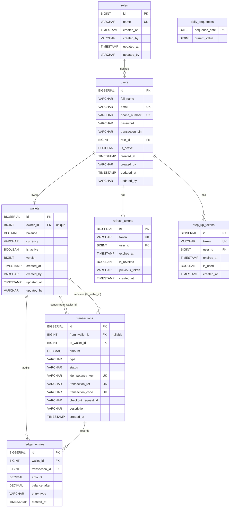

# VeraPay API 💳


## About

VeraPay is a production-grade mobile money and digital wallet REST API built with Spring Boot 4.0.1 and Java 25. It facilitates secure customer onboarding, wallet management, deposits, withdrawals, and peer-to-peer transfers. The system integrates directly with Safaricom's M-Pesa API (using STK Push for deposits and B2C payments for withdrawals) and enforces a strict double-entry ledger auditing system. Security is handled via stateless JWT authentication with secure HTTP-only refresh token rotation, compromised password verification, and one-time Step-Up PIN authentication for high-value operations. The API features a fully integrated OpenTelemetry (OTel) observability stack exporting metrics, logs, and traces to a Grafana LGTM container.

## Features

- **JWT Authentication & Rotation** — Secure, stateless role-based access control (RBAC) supporting `ROLE_CUSTOMER` and `ROLE_ADMIN`, with HTTP-only Cookie Refresh Token Rotation and active token reuse detection.
- **Step-Up Authentication** — Short-lived (5-minute), one-time-use Step-Up tokens issued upon transaction PIN validation to authorize sensitive operations (Transfers & Withdrawals).
- **M-Pesa Webhook Integration** — Direct Safaricom API integration supporting STK Push (C2B) deposits and Business-to-Customer (B2C) withdrawals, utilizing transactional callbacks and automated reversal-on-timeout safety.
- **Structured Transaction Codes** — Implements a daily-sequential transaction code format (e.g. `VP-YYYYMMDD-000001`) alongside the unguessable external `transactionRef` UUID, backed by a lock-free native upsert sequence counter.
- **Double-Entry Ledger System** — Strict financial compliance tracking all account modifications via immutable debit/credit entries in a ledger table linked directly to parent transactions.
- **JPA Optimistic Concurrency Control** — Utilizes `@Version` optimistic locking on the `Wallet` entity to guarantee transaction integrity and prevent double-spending or lost updates under high concurrent loads.
- **Distributed API Rate Limiting** — Configures Bucket4j backed by Lettuce and Redis to apply distributed rate limiting rules across auth, step-up, and registration endpoints.
- **Spring 7.0 / Boot 4.0 API Versioning** — Native Media-Type based API versioning configured via `ApiVersionConfigurer` using content negotiation (e.g. `application/vnd.eazyapp+json;v=1.0`).
- **AOP-Driven Auditing & Validation** — Modular AspectJ aspects handling automated request execution timing, method logging, registration inputs, and compromised password validation.
- **OTel Observability Stack** — Continuous telemetry exporting logs, metrics, and traces to Grafana LGTM (Loki, Tempo, Mimir, Grafana) via OTLP endpoints.
- **Trace-Linked Exceptions** — Intercepts application errors via a global exception handler and injects active Micrometer `traceId` values into client response payloads for simple debugging.

## Tech Stack

| Layer | Technology |
|---|---|
| Language | Java 25 |
| Framework | Spring Boot 4.0.1 / Spring 7.0 |
| Security | Spring Security + JWT + CSRF |
| Database | PostgreSQL |
| Cache & Rate Limiting | Caffeine Cache + Redis (Lettuce) + Bucket4j |
| Observability | OpenTelemetry + Grafana LGTM (Loki, Tempo, Mimir, Grafana) |
| Documentation | Swagger / OpenAPI (Springdoc-openapi v2.8.14) |
| Dev Tools | Spring Boot Docker Compose + Lombok + Java Mail Sender |
| Build Tool | Maven |

## Database Design

The database consists of 8 core tables with automated JPA Auditing (`BaseEntity` tracking `createdAt`, `createdBy`, `updatedAt`, and `updatedBy`):

- **Role** — Standardized RBAC roles (`ROLE_CUSTOMER`, `ROLE_ADMIN`).
- **User** — Customer and administrator accounts storing hashed credentials and transaction PINs.
- **Wallet** — Individual customer balance sheet, currency tracking (default `KES`), and transaction versioning.
- **Transaction** — Auditable financial transfers, deposits, and withdrawals displaying state (`PENDING`, `SUCCESS`, `FAILED`), structured transaction codes, and M-Pesa references.
- **DailySequence** — Stores daily transaction counters per date to guarantee uniqueness and concurrency safety.
- **LedgerEntry** — Immutable double-entry bookkeeping journal auditing wallet adjustments (debit/credit).
- **RefreshToken** — Tracks rotated tokens with users, expiration dates, and links to previous tokens for security reuse analysis.
- **StepUpToken** — Temp validation tickets generated on transaction PIN match, authorizing single operations.



## API Endpoints

All REST controllers are prefixed with `/api` (configured dynamically via `PathMatchConfigurer`).

### Auth & Tokens
| Method | Endpoint | Description | Access | Version |
|---|---|---|---|---|
| POST | `/api/auth/register/public` | Register a new customer user and create their wallet | Public | v1.0 |
| POST | `/api/auth/login/public` | Authenticate credentials, setting refresh token cookie | Public | v1.0 |
| POST | `/api/auth/refresh/public` | Exchange a valid HTTP-only refresh token for a new access token | Public | v1.0 |
| POST | `/api/auth/logout` | Revoke all session tokens and expire the cookie | Public | v1.0 |
| POST | `/api/auth/step-up` | Authenticate transaction PIN to obtain a temporary step-up token | Authenticated | - |

### Transactions
| Method | Endpoint | Description | Access | Version |
|---|---|---|---|---|
| POST | `/api/transactions/deposit` | Trigger an M-Pesa STK Push payment callback | CUSTOMER | v1.0 |
| POST | `/api/transactions/withdraw` | Request an M-Pesa B2C payout (validated by stepUpToken) | CUSTOMER | v1.0 |
| POST | `/api/transactions/transfer` | Send wallet funds to another user (validated by stepUpToken) | CUSTOMER | v1.0 |

### Wallet Management
| Method | Endpoint | Description | Access | Version |
|---|---|---|---|---|
| GET | `/api/wallet/profile` | View wallet details, currency, and balance info | CUSTOMER | v1.0 |
| GET | `/api/wallet/transactions` | Query recent transactions page (labeled DEBIT / CREDIT) | CUSTOMER | v1.0 |

### Security & Webhooks
| Method | Endpoint | Description | Access | Version |
|---|---|---|---|---|
| GET | `/api/csrf-token/public` | Retrieve the current HTTP session CSRF token | Public | v1.0 |
| POST | `/api/webhooks/mpesa/stk/callback` | Safaricom webhook confirming deposit callbacks | Public | - |
| POST | `/api/webhooks/mpesa/b2c/result` | Safaricom webhook resolving withdrawal requests | Public | - |
| POST | `/api/webhooks/mpesa/b2c/timeout` | Safaricom webhook reversing withdrawal on timeout | Public | - |

## Getting Started

### Prerequisites
- **Java 25**
- **Docker Desktop**
- **Maven** (or the included wrapper `./mvnw`)

### Configuration Environment
Before starting, create a `.env` file in the project root containing your system variables. Use the following structure:

```bash
# Database Settings
DATABASE_HOST=localhost
DATABASE_PORT=5432
DATABASE_NAME=verapay
DATABASE_USERNAME=postgres
DATABASE_PASSWORD=your_db_password

# Compose DB Config (must match settings above)
DB_USER=postgres
DB_PASSWORD=your_db_password
DB_NAME=verapay

# Redis Settings
REDIS_HOST=localhost
REDIS_PORT=6379
REDIS_PASSWORD=your_redis_password
SPRING_DATA_REDIS_PORT=6379

# M-Pesa Integration Credentials
MPESA_CONSUMER_KEY=your_mpesa_consumer_key
MPESA_CONSUMER_SECRET=your_mpesa_consumer_secret
MPESA_BUSINESS_SHORTCODE=174379
MPESA_PASSKEY=your_mpesa_passkey
MPESA_INITIATOR_NAME=testapi
MPESA_SECURITY_CREDENTIAL=your_mpesa_security_credential
MPESA_B2C_SHORTCODE=600996
MPESA_BASE_URL=https://sandbox.safaricom.co.ke
MPESA_CALLBACK_BASE_URL=your_ngrok_or_public_domain_url # e.g. https://xxxx.ngrok-free.app

# Java Mail Configurations
SPRING_MAIL_HOST=smtp.gmail.com
SPRING_MAIL_PORT=587
SPRING_MAIL_USERNAME=your_gmail@gmail.com
SPRING_MAIL_PASSWORD=your_app_password
MAIL_SMTP_FROM=VeraPay <noreply@verapay.com>
```

### Run Locally

1. **Clone the repository**
   ```bash
   git clone https://github.com/Nic3holas-wq/verapay.git
   cd verapay
   ```

2. **Initialize Docker Containers**
   VeraPay integrates the `spring-boot-docker-compose` module. As soon as you start the application, Spring Boot will automatically spin up PostgreSQL, Redis, and the Grafana LGTM observability stack from `compose.yml`. Ensure Docker Desktop is running.

   ```bash
   ./mvnw spring-boot:run
   ```

3. **Access Grafana Dashboard**
   Telemetry data is exported automatically. Monitor traces, logs, and metrics at:
   - **URL:** [http://localhost:3000](http://localhost:3000)

4. **Access Swagger UI**
   Explore the API endpoints directly:
   - **URL:** [http://localhost:8080/swagger-ui/index.html](http://localhost:8080/swagger-ui/index.html)
   - **Actuator Management Port:** `http://localhost:9090/verapay/actuator`

---

## Key Technical Decisions

### Why Optimistic Locking on Wallets?
Financial balance updates are highly concurrent and prone to race conditions (such as double-spending or lost updates). Rather than locking database rows with heavy, blocking Pessimistic locks that restrict throughput, VeraPay uses Hibernate's `@Version` optimistic locking on the `Wallet` entity. If a transaction detects that the wallet has been updated since it was loaded, it triggers an exception and aborts, guaranteeing absolute transactional integrity at scale.

### Why a Double-Entry Ledger System?
Direct updates to a balance column are simple but fail to leave a secure audit trail. By enforcing a double-entry ledger bookkeeping model, every single deposit, withdrawal, and transfer must log corresponding debit or credit details in `ledger_entries` linked directly to the parent transaction. This ensures compliance, enables simple balance reconstruction, and simplifies financial audits.

### Why Step-Up Authentication for Transfers & Withdrawals?
Allowing users to transfer or withdraw funds using only their standard session JWT exposes the wallet to session hijacking. To mitigate this risk, sensitive actions require a short-lived (5-minute), single-use Step-Up token. The client obtains this token by calling the `/step-up` endpoint with their transaction PIN. The token is immediately validated and invalidated upon execution of the transaction.

### Why Refresh Token Rotation & Reuse Detection?
VeraPay uses rotated refresh tokens stored in secure, HTTP-only, SameSite cookies. When the client requests a new access token, the current refresh token is revoked, and a new one is issued. If an attacker intercepts a previously used refresh token and attempts to replay it, the reuse detection mechanism triggers, invalidates all active sessions for that user, and forces a complete re-login.

### Why Distributed Rate Limiting via Redis + Bucket4j?
Clustered environments render in-memory rate limiting ineffective. VeraPay utilizes Bucket4j backed by Lettuce and Redis to distribute bucket states globally. This applies strict rate limits across login (5/min per IP), registration (3/hr per IP), refresh token (10/min per IP), and step-up (3/5min per email) endpoints.

### Why Trace IDs in API Exception Payloads?
Locating logs matching a specific client-side error in a distributed system is challenging. The global exception handler extracts the active transaction `traceId` using Micrometer's `Tracer` and returns it within the JSON error response payload. Developers can copy this trace ID directly into Grafana to inspect execution flows, query performance, and exceptions.

### Why Aspect-Oriented Programming (AOP) for Cross-Cutting Concerns?
Separating logging, timing, and security checks from business services ensures a clean codebase. VeraPay implements modular AspectJ aspects to handle execution profiling (`LoggingAndPerformanceAspect`), audit successful logins (`LoginSuccessAuditAspect`), track throwables (`ExceptionAuditAspect`), and run registration check pipelines (`RegisterValidationAspect`), ensuring controllers and services only focus on their core logic.

### Why Structured Transaction Codes Alongside transactionRef?
External identifiers like `transactionRef` use random UUID fragments for unguessability and security (e.g., to prevent ID harvesting or enumerations). However, UUIDs lack structure for accounting and daily reconciliation. VeraPay introduces an additional `transactionCode` field using a structured format (`VP-YYYYMMDD-000001`). This format allows administrators and auditors to easily filter, group, and reconcile transactions sequentially by date and batch.

### Why Table-Based Daily Sequence Counters for Concurrency?
To generate unique daily-sequential numbers, standard DB sequences cannot easily be reset daily without complex cron configurations and administrative DDL queries. VeraPay uses a `daily_sequences` table containing date-based rows. By executing atomic native updates with conflict resolution (`INSERT ... ON CONFLICT DO UPDATE RETURNING`), we lock the row for the active date, ensure thread-safe incrementing under highly concurrent requests, reset the sequence automatically on the start of a new day, and rollback the increment if the parent transaction rolls back.

---
## Testing
API Documentation and testing: https://verapay-production.up.railway.app/swagger-ui/index.html
## Author

Nicholas Murimi  
LinkedIn: [Nicholas Murimi](https://www.linkedin.com/in/muriminicholas/)  
GitHub: [Nic3holas-wq](https://github.com/Nic3holas-wq)
